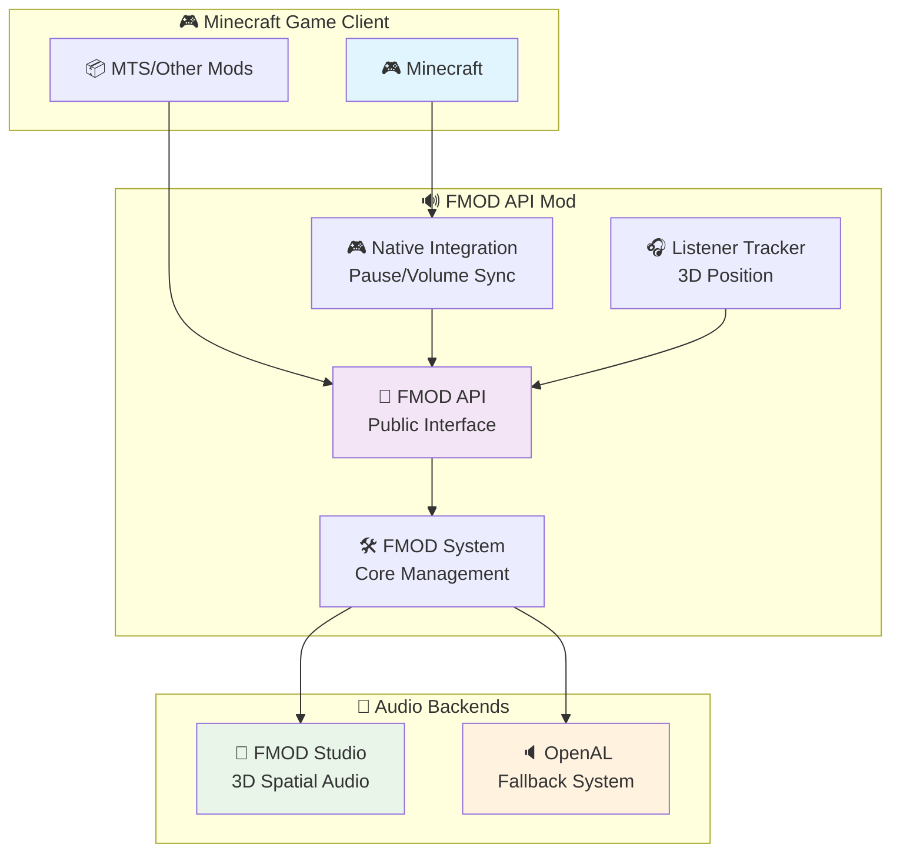
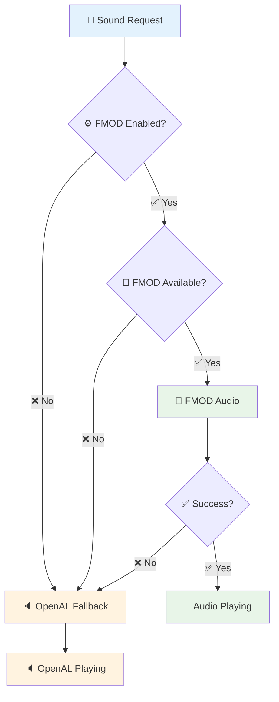

# 🏗️ FMOD API Advanced Technical Guide

> **Deep technical architecture and MTS integration details for FMOD API**

---

## 📋 Table of Contents

1. [🎯 Overview](#-overview)
2. [🏗️ System Architecture](#️-system-architecture)
3. [⚙️ Core Implementation](#️-core-implementation)
4. [🎮 Minecraft Native Integration](#-minecraft-native-integration)
5. [💾 Bank Management](#-bank-management)
6. [🔧 MTS Integration](#-mts-integration)
7. [🐛 Troubleshooting](#-troubleshooting)

---

## 🎯 Overview

The FMOD API provides **high-quality 3D spatial audio** with **native Minecraft integration** while maintaining **100% compatibility** with OpenAL as a fallback system.

### ✨ Key Features

| Feature | Description | Benefit |
|---------|-------------|---------|
| 🎮 **Native Integration** | Automatic pause/resume with ESC menu | Behaves like vanilla Minecraft |
| 🔊 **Volume Sync** | Respects all Minecraft volume sliders | Seamless user experience |
| 🔀 **Hybrid Audio** | FMOD + OpenAL dual system | Best of both worlds |
| ⚡ **Runtime Switching** | Toggle without restart | Instant configuration changes |
| 🛡️ **Graceful Fallback** | Automatic OpenAL backup | Never lose audio |

---

## 🏗️ System Architecture

### 📊 Component Overview



### 📦 Component Structure

```
FMOD API Mod
├── 🎵 Core Audio Engine (FMODAPI.java)
│   ├── Event playback methods (playEvent, playEventSimple)
│   ├── Minecraft integration methods (pauseAllSounds, resumeAllSounds, setMasterVolume)
│   ├── Bank management (registerBank, loadBankFromResource)
│   └── 3D audio (setListenerPosition, Vec3D)
│
├── 🎮 Minecraft Integration (FMODMinecraftIntegration.java)
│   ├── Automatic pause/resume on ESC menu
│   ├── Real-time volume synchronization
│   └── Event-driven monitoring (ClientTickEvent)
│
├── 🎧 Listener Tracking (FMODListenerTracker.java)
│   ├── Automatic player position tracking
│   ├── 3D orientation updates
│   └── Performance-optimized change detection
│
├── ⚙️ Configuration (FMODConfig.java)
│   ├── FMOD enabled toggle (runtime changes)
│   ├── Debug logging control
│   └── Max instances setting (32-4096)
│
└── 🔧 System Management (FMODSystem.java)
    ├── FMOD initialization and lifecycle
    ├── Bank loading and management
    └── Instance tracking and cleanup
```

---

## ⚙️ Core Implementation

### 🚀 Smart Routing System

**Core Principle:** Check config once, route intelligently, fallback gracefully

```java
// FMODAPI.java - The intelligent audio router
public static String playEvent(String eventName, Vec3D position, float volume, float pitch) {
    // 🚦 Config-based routing decision
    try {
        if (!FMODConfig.FMOD_ENABLED.get()) {
            System.out.println("[FMOD API] FMOD routing disabled - sound will use OpenAL fallback");
            return null; // 🎯 Explicit OpenAL fallback trigger
        }
    } catch (Exception e) {
        System.out.println("[FMOD API] Config unavailable, defaulting to FMOD routing");
    }

    // 🎵 FMOD path - proceed with FMOD Studio
    if (!isAvailable()) {
        return null; // 🛡️ Fallback if FMOD not ready
    }

    // ... FMOD implementation
    return FMODSystem.playEvent(eventName, position, volume, pitch);
}
```

#### 🚦 Routing Decision Tree



### 📦 Bank Management System

**Pattern:** Register early, load when ready, store for reliability

```java
// Registration during mod initialization
public static boolean registerBank(Class<?> modClass, String resourcePath) {
    return FMODSystem.registerBank(modClass, resourcePath);
}

// Loading with resource extraction
private static boolean loadBankFromStream(InputStream bankStream, String resourcePath) throws Exception {
    byte[] bankData = bankStream.readAllBytes();

    // 📦 ALWAYS store for automatic reloading
    FMODSystem.storeBankData(fileName, bankData);

    // 📁 Extract to temp file for FMOD
    Path tempFile = Files.createTempFile("fmodapi_" + fileName, ".bank");
    Files.write(tempFile, bankData);

    // 🎵 Load into FMOD (if available)
    return loadBankWithName(tempFile.toString(), fileName);
}
```

### 🔄 Configuration System

**Simplified Flat Structure** - No nested categories, immediate runtime changes

```java
// FMODConfig.java - Clean, simple configuration
static {
    FMOD_ENABLED = BUILDER
        .comment("Enable FMOD audio system (takes effect immediately)")
        .translation("config.fmodapi.fmod_enabled")
        .define("fmodEnabled", true);

    DEBUG_LOGGING = BUILDER
        .comment("Enable debug logging for FMOD API")
        .translation("config.fmodapi.debug_logging")
        .define("debugLogging", false);

    MAX_INSTANCES = BUILDER
        .comment("Maximum number of concurrent FMOD sound instances (32-4096)")
        .translation("config.fmodapi.max_instances")
        .defineInRange("maxInstances", 512, 32, 4096);
}
```

#### ⚡ Runtime Configuration Changes

```java
@SubscribeEvent
static void onReload(final ModConfigEvent.Reloading event) {
    boolean fmodEnabled = FMOD_ENABLED.get();
    boolean fmodCurrentlyRunning = FMODSystem.isInitialized();

    if (fmodEnabled && !fmodCurrentlyRunning) {
        // User enabled FMOD - initialize it
        FMODSystem.checkConfigAndInit();
    } else if (!fmodEnabled && fmodCurrentlyRunning) {
        // User disabled FMOD - shut it down
        FMODSystem.shutdown();
    }
    // No restart required!
}
```

---

## 🎮 Minecraft Native Integration

### ⚡ Instant Pause/Resume System

**Implementation:** Monitor game state every tick, respond instantly

```java
// FMODMinecraftIntegration.java
@SubscribeEvent
public static void onClientTick(ClientTickEvent.Pre event) {
    // 🎯 Simple, reliable pause detection
    boolean hasScreenOpen = minecraft.screen != null;
    if (hasScreenOpen != wasPaused) {
        if (hasScreenOpen) {
            FMODAPI.pauseAllSounds();  // 🎯 <1ms response
        } else {
            FMODAPI.resumeAllSounds(); // ⚡ Instant resume
        }
        wasPaused = hasScreenOpen;
    }
}
```

### 🔊 Real-Time Volume Synchronization

**Formula:** `FMOD Volume = Master × ((Music + Sound Effects) ÷ 2)`

```java
// Volume sync using correct NeoForge 1.21.1 API
float masterVolume = options.getSoundSourceVolume(SoundSource.MASTER);
float musicVolume = options.getSoundSourceVolume(SoundSource.MUSIC);
float soundVolume = options.getSoundSourceVolume(SoundSource.BLOCKS);

// Calculate combined volume
float combinedVolume = masterVolume * ((musicVolume + soundVolume) / 2.0f);
FMODAPI.setMasterVolume(combinedVolume);
```

### 🎧 Automatic Listener Tracking

**Performance-Optimized:** Only update when player actually moves

```java
// FMODListenerTracker.java
@SubscribeEvent
public static void onPlayerTick(PlayerTickEvent.Post event) {
    // 🎯 Change detection with thresholds
    boolean positionChanged = (
        Math.abs(currentX - lastX) > POSITION_THRESHOLD ||
        Math.abs(currentY - lastY) > POSITION_THRESHOLD ||
        Math.abs(currentZ - lastZ) > POSITION_THRESHOLD
    );

    if (positionChanged || rotationChanged) {
        // 🎵 Update FMOD listener only when needed
        FMODAPI.setListenerPosition(currentX, currentY, currentZ,
                                  forwardX, forwardY, forwardZ,
                                  velX, velY, velZ);
    }
}
```

---

## 💾 Bank Management

### 📋 Registration Pattern

**Recommended approach for mods:**

```java
// During mod initialization
public class MyMod {
    public static void init() {
        // 📦 Register banks for automatic loading
        FMODAPI.registerBank(MyMod.class, "/assets/mymod/sounds/master.strings.bank");
        FMODAPI.registerBank(MyMod.class, "/assets/mymod/sounds/master.bank");
        FMODAPI.registerBank(MyMod.class, "/assets/mymod/sounds/vehicles.bank");
    }
}
```

### 🔄 Bank Lifecycle

| State | Description | When |
|-------|-------------|------|
| **📝 Registered** | Stored for automatic loading | Mod initialization |
| **📥 Loaded** | Extracted and loaded into FMOD | FMOD system ready |
| **🎵 Active** | Available for event playback | FMOD enabled |
| **💤 Inactive** | Not used but still loaded | FMOD disabled |
| **🗑️ Cleanup** | Released from memory | Game shutdown |

### 📁 Resource Handling

```java
// Automatic resource extraction and cleanup
private static boolean loadBankFromStream(InputStream bankStream, String resourcePath) {
    // 1. Read from JAR resource
    byte[] bankData = bankStream.readAllBytes();

    // 2. Store for reloading
    FMODSystem.storeBankData(fileName, bankData);

    // 3. Extract to temp file
    Path tempFile = Files.createTempFile("fmodapi_" + fileName, ".bank");
    tempFile.toFile().deleteOnExit(); // 🗑️ Auto cleanup
    Files.write(tempFile, bankData);

    // 4. Load into FMOD
    return loadBankWithName(tempFile.toString(), fileName);
}
```

---

## 🔧 MTS Integration

### 🎵 MTS Sound Integration

MTS integrates with FMOD API through the routing system:

```java
// MTS InterfaceSound.java integration pattern
public static void playQuickSound(SoundInstance sound) {
    // 🎯 Try FMOD first (if enabled)
    String fmodResult = FMODAPI.playEvent(soundName, position, volume, pitch);
    if (fmodResult != null) {
        return; // ✅ FMOD succeeded
    }

    // 🔈 Fallback to OpenAL
    playOpenALSound(sound);
}
```

### 📦 MTS Bank Registration

```java
// MTS registers its banks during initialization
public static void FMODSystemInit() {
    // 🎵 Core audio banks
    FMODAPI.registerBank(Point3D.class, "/assets/mts/sounds/fmod/Master.strings.bank");
    FMODAPI.registerBank(Point3D.class, "/assets/mts/sounds/fmod/Master.bank");

    // 🔫 Weapons audio bank
    FMODAPI.registerBank(Point3D.class, "/assets/mts/sounds/fmod/Weapons.bank");
}
```

### 🎮 Automatic Integration Benefits

**Zero Code Changes Required:**
- ✅ Pause/resume happens automatically
- ✅ Volume sync works automatically
- ✅ 3D listener tracking works automatically
- ✅ Fallback to OpenAL works automatically

---

## 🐛 Troubleshooting

### 🔍 Common Issues

| Issue | Symptoms | Solution |
|-------|----------|----------|
| **FMOD not initializing** | Red initialization errors | Check native library paths, verify FMOD system requirements |
| **Banks not loading** | "Failed to load bank" errors | Verify bank file paths, check resource packaging |
| **Sounds don't pause** | FMOD continues during ESC menu | Enable debug logging, check integration status |
| **Volume not syncing** | FMOD ignores Minecraft sliders | Verify NeoForge 1.21.1 compatibility |
| **Performance issues** | Audio stuttering | Check max instances setting, monitor active sound count |

### 📊 Debug Information

Enable debug logging in config to see:

```
[FMOD Integration] Minecraft native integration initialized
[FMOD Integration] Initial volume set to: 0.7 (Master: 1.0, Music: 0.8, Sound: 0.6)
[FMOD Integration] Screen detected - pausing FMOD sounds
[FMOD Integration] No screen - resuming FMOD sounds
[FMOD API] Auto-listener update - Pos:(100.5, 64.0, 200.3) Vel:(0.12, 0.00, 0.05)
```

### ⚡ Performance Monitoring

| Metric | Expected | Troubleshooting |
|--------|----------|----------------|
| **Pause Response** | <1ms | Check ClientTickEvent conflicts |
| **Volume Update** | ~50ms | Normal (limited by tick rate) |
| **Memory Usage** | Stable | Banks stay loaded, only routing changes |
| **CPU Impact** | Negligible | Event-driven updates only |

### 🛠️ Developer Tools

```java
// Status checking
boolean fmodReady = FMODAPI.isAvailable();
int activeSounds = FMODAPI.getActiveInstanceCount();
int maxSounds = FMODAPI.getMaxInstanceCount();

// Calculate usage
float usage = (float) activeSounds / maxSounds * 100f;
```

---

## 📚 File Structure

```
FMOD API Project Structure:
fmod-API/
├── src/main/java/com/fmodapi/
│   ├── FMODAPI.java                     # 🎵 Main public API
│   ├── FMODSystem.java                  # 🔧 Core system management
│   ├── FMODConfig.java                  # ⚙️ Configuration handling
│   ├── FMODMinecraftIntegration.java    # 🎮 Native Minecraft integration
│   ├── FMODListenerTracker.java         # 🎧 Automatic 3D listener tracking
│   └── Vec3D.java                       # 📐 3D vector utility
├── src/main/resources/
│   ├── libraries/                       # 📚 Native FMOD libraries
│   │   ├── fmodstudio.dll
│   │   └── fmod.dll
│   └── assets/fmodapi/lang/            # 🌍 Translations
│       ├── en_us.json
│       └── pl_pl.json
└── docs/                               # 📖 Documentation
    ├── README.md                       # 🏠 Main documentation hub
    ├── API_REFERENCE.md                # 📚 Complete API reference
    ├── MINECRAFT_NATIVE_INTEGRATION.md # 🎮 Native integration guide
    ├── CONFIGURATION_SYSTEM.md         # ⚙️ Configuration documentation
    └── ADVANCED_TECHNICAL_GUIDE.md     # 🏗️ This file
```

---

*This technical guide covers the current implementation of FMOD API with native Minecraft integration for v2.0+*