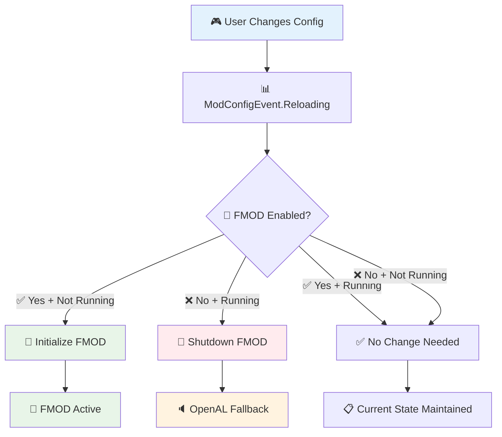

# ⚙️ FMOD API Configuration System

> **Complete guide to the streamlined FMOD configuration system**

---

## 📋 Table of Contents

1. [🎯 Overview](#-overview)
2. [🎛️ Configuration Options](#️-configuration-options)
3. [🏗️ Implementation Details](#️-implementation-details)
4. [🔄 Runtime Changes](#-runtime-changes)
5. [🌍 Multi-Language Support](#-multi-language-support)
6. [🔧 Developer Guide](#-developer-guide)

---

## 🎯 Overview

The FMOD API features a **simplified, flat configuration system** designed for ease of use and reliability. Gone are the complex nested categories - now everything is straightforward and user-friendly.

### ✨ Key Improvements

| Feature | Old System | New System | Benefit |
|---------|------------|------------|---------|
| **🎛️ Structure** | Complex nested categories | Flat, simple layout | Easier to understand |
| **📊 Status Fields** | Read-only status displays | Removed entirely | Cleaner interface |
| **🔄 Updates** | Complex refresh logic | Automatic handling | More reliable |
| **🎮 UI** | External dependencies | Native NeoForge | Better compatibility |
| **⚡ Performance** | Periodic status checks | Event-driven only | More efficient |

---

## 🎛️ Configuration Options

### 📋 Core Settings

```java
// FMODConfig.java - Clean, simple structure
public static final ModConfigSpec.BooleanValue FMOD_ENABLED;
public static final ModConfigSpec.BooleanValue DEBUG_LOGGING;
public static final ModConfigSpec.IntValue MAX_INSTANCES;
```

### ⚙️ Configuration Details

#### 🎵 FMOD Enabled
- **Type:** Boolean toggle
- **Default:** `true`
- **Description:** Controls whether FMOD audio system is active
- **Effect:** Takes effect immediately without restart
- **Translation Key:** `config.fmodapi.fmod_enabled`

```java
FMOD_ENABLED = BUILDER
    .comment("Enable FMOD audio system (takes effect immediately)")
    .translation("config.fmodapi.fmod_enabled")
    .define("fmodEnabled", true);
```

#### 🐛 Debug Logging
- **Type:** Boolean toggle
- **Default:** `false`
- **Description:** Enables detailed logging for troubleshooting
- **Effect:** Controls debug output verbosity
- **Translation Key:** `config.fmodapi.debug_logging`

```java
DEBUG_LOGGING = BUILDER
    .comment("Enable debug logging for FMOD API - useful for troubleshooting audio issues")
    .translation("config.fmodapi.debug_logging")
    .define("debugLogging", false);
```

#### 🎚️ Maximum Instances
- **Type:** Integer with range validation
- **Default:** `512`
- **Range:** 32 to 4096
- **Description:** Maximum number of concurrent FMOD sound instances
- **Effect:** Controls memory usage and performance
- **Translation Key:** `config.fmodapi.max_instances`

```java
MAX_INSTANCES = BUILDER
    .comment("Maximum number of concurrent FMOD sound instances (32-4096, default: 512)")
    .translation("config.fmodapi.max_instances")
    .defineInRange("maxInstances", 512, 32, 4096);
```

### 🎮 User Interface

The configuration uses **native NeoForge ConfigurationScreen** for maximum compatibility:

```java
// FMODAPIClient.java - Native integration
container.registerExtensionPoint(IConfigScreenFactory.class, ConfigurationScreen::new);
```

**Access Points:**
- **Main Menu:** Mods → FMOD API → Config
- **In-Game:** ESC → Mod Options → FMOD API

---

## 🏗️ Implementation Details

### 📦 Simplified Structure

#### ❌ Removed Complexity
The old system had unnecessary complexity that has been streamlined:

```java
// OLD: Complex nested structure (REMOVED)
// - FMOD Settings category
//   - FMOD_ENABLED
//   - DEBUG_LOGGING
// - Status Information category (READ-ONLY)
//   - FMOD_STATUS
//   - AUDIO_SYSTEM
//   - LOADED_BANKS_COUNT
//   - ACTIVE_INSTANCES_COUNT
//   - ERROR_MESSAGE
```

#### ✅ New Clean Structure
```java
// NEW: Flat, simple structure
static {
    FMOD_ENABLED = BUILDER.define("fmodEnabled", true);
    DEBUG_LOGGING = BUILDER.define("debugLogging", false);
    MAX_INSTANCES = BUILDER.defineInRange("maxInstances", 512, 32, 4096);
}
```

### 🚫 Removed Components

| Component | Reason for Removal | Replacement |
|-----------|-------------------|-------------|
| **Status Categories** | Complex, read-only | Command-based status (/fmodapi status) |
| **Periodic Updates** | Performance overhead | Event-driven updates only |
| **External Dependencies** | Compatibility issues | Native NeoForge APIs |
| **Refresh Methods** | Complex state management | Automatic config detection |

---

## 🔄 Runtime Changes

### ⚡ Immediate Effect System

Configuration changes apply **immediately** without requiring restart:

```java
@SubscribeEvent
static void onReload(final ModConfigEvent.Reloading event) {
    System.out.println("=== FMOD API CONFIG CHANGE DETECTED ===");
    handleRuntimeConfigChange();
}

private static void handleRuntimeConfigChange() {
    boolean fmodEnabled = FMOD_ENABLED.get();
    boolean fmodCurrentlyRunning = FMODSystem.isInitialized();

    if (fmodEnabled && !fmodCurrentlyRunning) {
        // User enabled FMOD - initialize it
        FMODSystem.checkConfigAndInit();
    } else if (!fmodEnabled && fmodCurrentlyRunning) {
        // User disabled FMOD - shut it down
        FMODSystem.shutdown();
    }
}
```

### 🔄 Change Detection Flow



### ⏱️ Change Response Times

| Setting | Detection | Application | Total Time |
|---------|-----------|-------------|------------|
| **FMOD Enabled** | Immediate | ~50-100ms | **<150ms** |
| **Debug Logging** | Immediate | Immediate | **<1ms** |
| **Max Instances** | Immediate | Next FMOD init | **Variable** |

---

## 🌍 Multi-Language Support

### 🇺🇸 English (en_us.json)
```json
{
  "config.fmodapi.fmod_enabled": "Enable FMOD Audio",
  "config.fmodapi.debug_logging": "Enable Debug Logging",
  "config.fmodapi.max_instances": "Maximum Sound Instances"
}
```

### 🇵🇱 Polish (pl_pl.json)
```json
{
  "config.fmodapi.fmod_enabled": "Włącz Audio FMOD",
  "config.fmodapi.debug_logging": "Włącz Logowanie Debugowania",
  "config.fmodapi.max_instances": "Maksymalna Liczba Instancji Dźwięku"
}
```

### 🌐 Adding New Languages

To add a new language:

1. **Create language file:**
   ```
   src/main/resources/assets/fmodapi/lang/{locale}.json
   ```

2. **Add translations:**
   ```json
   {
     "config.fmodapi.fmod_enabled": "[Translation]",
     "config.fmodapi.debug_logging": "[Translation]",
     "config.fmodapi.max_instances": "[Translation]"
   }
   ```

3. **Minecraft will automatically use it** based on user's language setting

---

## 🔧 Developer Guide

### 📚 Accessing Configuration

```java
// Reading configuration values
boolean fmodEnabled = FMODConfig.FMOD_ENABLED.get();
boolean debugMode = FMODConfig.DEBUG_LOGGING.get();
int maxInstances = FMODConfig.MAX_INSTANCES.get();

// Example usage
if (FMODConfig.DEBUG_LOGGING.get()) {
    System.out.println("[FMOD API] Debug info: " + message);
}
```

### ⚙️ Config-Driven Features

```java
// Conditional logging based on config
public static void debugLog(String message) {
    if (FMODConfig.DEBUG_LOGGING.get()) {
        System.out.println("[FMOD API Debug] " + message);
    }
}

// FMOD routing based on config
public static String playEvent(String eventName, Vec3D position, float volume, float pitch) {
    if (!FMODConfig.FMOD_ENABLED.get()) {
        return null; // Triggers OpenAL fallback
    }
    return FMODSystem.playEvent(eventName, position, volume, pitch);
}
```

### 🏗️ Adding New Config Options

```java
// 1. Add the field
public static final ModConfigSpec.BooleanValue NEW_OPTION;

// 2. Initialize in static block
static {
    NEW_OPTION = BUILDER
        .comment("Description of the new option")
        .translation("config.fmodapi.new_option")
        .define("newOption", defaultValue);
}

// 3. Add translation
// en_us.json: "config.fmodapi.new_option": "New Option Display Name"
```

### 🔄 Handling Config Changes

```java
// Listen for config changes
@SubscribeEvent
static void onConfigChange(final ModConfigEvent.Reloading event) {
    if (event.getConfig().getModId().equals("fmodapi")) {
        // Handle the change
        handleNewOptionChange();
    }
}
```

---

## 📊 Configuration Comparison

### 📈 Before vs After

| Aspect | Old System | New System | Improvement |
|--------|------------|------------|-------------|
| **📝 Lines of Code** | ~200 lines | ~90 lines | **55% reduction** |
| **⚙️ Config Categories** | 2 nested | 1 flat | **Simpler** |
| **📊 Status Fields** | 5 read-only | 0 | **Cleaner UI** |
| **🔄 Update Logic** | Complex refresh | Event-driven | **More reliable** |
| **🎮 UI Dependencies** | External libs | Native NeoForge | **Better compatibility** |
| **⚡ Performance** | Periodic checks | Change events only | **More efficient** |

### 🎯 Key Benefits

1. **👥 User Experience:**
   - Simpler interface with fewer options
   - Immediate feedback on changes
   - Native look and feel

2. **🔧 Developer Experience:**
   - Cleaner code structure
   - Easier to maintain
   - Fewer dependencies

3. **🚀 Performance:**
   - No periodic status updates
   - Event-driven architecture
   - Reduced memory footprint

4. **🛡️ Reliability:**
   - Native NeoForge APIs
   - Simplified state management
   - Fewer points of failure

---

*The streamlined configuration system provides all essential controls while maintaining simplicity and reliability.*