# Advanced Technical Guide

Deep technical architecture and advanced integration details for FMOD API.

## 🏗️ System Architecture

### Component Overview

```mermaid
graph TB
    subgraph "🎮 Minecraft Game Client"
        MC[🎮 Minecraft]
        MTS[📦 MTS/Other Mods]
    end

    subgraph "🔊 FMOD API Mod"
        API[🎵 FMOD API<br/>Public Interface]
        INT[🎮 Native Integration<br/>Pause/Volume Sync]
        SYS[🛠️ FMOD System<br/>Core Management]
        LISTEN[🎧 Listener Tracker<br/>3D Position]
    end

    subgraph "🎵 Audio Backends"
        FMOD[🎼 FMOD Studio<br/>3D Spatial Audio]
        OPENAL[🔈 OpenAL<br/>Fallback System]
    end

    MC --> INT
    MTS --> API
    API --> SYS
    INT --> API
    LISTEN --> API
    SYS --> FMOD
    SYS --> OPENAL

    style MC fill:#e1f5fe
    style API fill:#f3e5f5
    style FMOD fill:#e8f5e8
    style OPENAL fill:#fff3e0
```



### Component Structure

```
FMOD API Mod
├── 🎵 Core Audio Engine (FMODAPI.java)
│   ├── Event playback methods (playEvent, playEventSimple)
│   ├── Minecraft integration methods (pauseAllSounds, resumeAllSounds, setMasterVolume)
│   ├── Bank management (registerBank, loadBankFromResource)
│   └── 3D audio (setListenerPosition, Vec3D)
│
├── 🎮 Minecraft Integration (FMODMinecraftIntegration.java)
│   ├── Automatic pause/resume on ESC menu
│   ├── Real-time volume synchronization
│   └── Event-driven monitoring (ClientTickEvent)
│
├── 🎧 Listener Tracking (FMODListenerTracker.java)
│   ├── Automatic player position tracking
│   ├── 3D orientation updates
│   └── Performance-optimized change detection
│
├── ⚙️ Configuration (FMODConfig.java)
│   ├── FMOD enabled toggle (runtime changes)
│   ├── Debug logging control
│   └── Max instances setting (32-4096)
│
└── 🔧 System Management (FMODSystem.java)
    ├── FMOD initialization and lifecycle
    ├── Bank loading and management
    └── Instance tracking and cleanup
```

## ⚙️ Core Implementation

### FMOD System Lifecycle

```java
// FMODSystem.java - Core system management
public class FMODSystem {

    // 1. Initialization
    public static boolean init() {
        try {
            loadSystemLibraries();     // Load FMOD DLLs
            initializeFMODCore();      // Initialize FMOD Core
            initializeFMODStudio();    // Initialize FMOD Studio
            setupChannelGroups();      // Configure audio groups
            startUpdateThread();       // Begin update loop
            return true;
        } catch (Exception e) {
            handleInitializationFailure(e);
            return false;
        }
    }

    // 2. Runtime Management
    public static void update() {
        if (isInitialized()) {
            fmodStudioSystem.update();  // Update FMOD Studio
            cleanupFinishedInstances(); // Remove completed sounds
            updateListenerPosition();   // Sync 3D position
        }
    }

    // 3. Cleanup
    public static void shutdown() {
        stopAllInstances();
        releaseBanks();
        shutdownFMODStudio();
        shutdownFMODCore();
        unloadLibraries();
    }
}
```

### Library Loading Strategy

```java
// 3-tier detection system
private static void loadSystemLibraries() throws Exception {
    // 1. Try JAR resources (development builds)
    if (tryLoadFromJARResources()) return;

    // 2. Try custom path (user configuration)
    if (tryLoadFromCustomPath()) return;

    // 3. Try system detection (auto-detection)
    if (tryLoadFromSystemPath()) return;

    // 4. Try common installation paths
    if (tryLoadFromCommonPaths()) return;

    throw new Exception("Failed to load FMOD libraries from all search paths");
}

private static boolean tryLoadFromCustomPath() {
    String customPath = FMODConfig.FMOD_CUSTOM_PATH.get();
    if (customPath.isEmpty()) return false;

    // Recursive search up to 4 levels
    List<File> dllFiles = findDLLsRecursively(new File(customPath), 4);
    return loadDLLsFromFiles(dllFiles);
}
```

### Instance Management

```java
// Concurrent instance tracking
private static final ConcurrentHashMap<String, Long> activeInstances = new ConcurrentHashMap<>();
private static final AtomicInteger instanceCounter = new AtomicInteger(0);

public static String playEvent(String eventName, Vec3D position, float volume, float pitch) {
    if (!isAvailable()) return null;

    try {
        // Check instance limit
        if (activeInstances.size() >= FMODConfig.MAX_INSTANCES.get()) {
            cleanupFinishedInstances();
            if (activeInstances.size() >= FMODConfig.MAX_INSTANCES.get()) {
                return null; // Instance limit reached
            }
        }

        // Create and start event instance
        long eventInstanceHandle = createEventInstance(eventName);
        if (eventInstanceHandle == 0) return null;

        // Configure instance
        setInstancePosition(eventInstanceHandle, position);
        setInstanceVolume(eventInstanceHandle, volume);
        setInstancePitch(eventInstanceHandle, pitch);

        // Start playback
        startInstance(eventInstanceHandle);

        // Track instance
        String instanceId = generateInstanceId();
        activeInstances.put(instanceId, eventInstanceHandle);

        return instanceId;

    } catch (Exception e) {
        System.err.println("Failed to play FMOD event: " + eventName);
        return null;
    }
}
```

## 🎮 Minecraft Native Integration

### Pause/Resume Implementation

```java
// FMODMinecraftIntegration.java
public class FMODMinecraftIntegration {
    private static boolean wasPaused = false;

    @SubscribeEvent
    public static void onClientTick(ClientTickEvent.Pre event) {
        if (!FMODAPI.isAvailable()) return;

        // 1. Handle pause/resume
        handlePauseResume();

        // 2. Sync volume
        updateVolumeSync();

        // 3. Update 3D listener
        updateListenerPosition();
    }

    private static void handlePauseResume() {
        Minecraft minecraft = Minecraft.getInstance();
        boolean hasScreenOpen = minecraft.screen != null;

        if (hasScreenOpen != wasPaused) {
            if (hasScreenOpen) {
                FMODAPI.pauseAllSounds();
                debugLog("FMOD sounds paused (menu opened)");
            } else {
                FMODAPI.resumeAllSounds();
                debugLog("FMOD sounds resumed (menu closed)");
            }
            wasPaused = hasScreenOpen;
        }
    }
}
```

### Volume Synchronization

```java
private static void updateVolumeSync() {
    Minecraft minecraft = Minecraft.getInstance();

    // Get Minecraft volume settings
    float masterVolume = minecraft.options.getSoundCategoryVolume(SoundCategory.MASTER);
    float soundVolume = minecraft.options.getSoundCategoryVolume(SoundCategory.BLOCKS);

    // Calculate final volume
    float finalVolume = masterVolume * soundVolume;

    // Apply to FMOD system
    if (Math.abs(finalVolume - lastSyncedVolume) > 0.01f) {
        FMODAPI.setMasterVolume(finalVolume);
        lastSyncedVolume = finalVolume;

        debugLog("Volume synced: " + String.format("%.2f", finalVolume));
    }
}
```

### 3D Listener Tracking

```java
// FMODListenerTracker.java
public class FMODListenerTracker {
    private static Vec3 lastPosition = Vec3.ZERO;
    private static Vec3 lastLookDirection = Vec3.ZERO;

    @SubscribeEvent
    public static void onClientTick(ClientTickEvent.Pre event) {
        if (!FMODAPI.isAvailable()) return;

        Player player = Minecraft.getInstance().player;
        if (player == null) return;

        // Get current position and orientation
        Vec3 currentPos = player.position();
        Vec3 lookDirection = player.getLookAngle();

        // Only update if significant change (optimization)
        if (currentPos.distanceTo(lastPosition) > 0.1 ||
            lookDirection.distanceTo(lastLookDirection) > 0.01) {

            // Update FMOD listener
            FMODAPI.setListenerPosition(
                currentPos.x, currentPos.y, currentPos.z,
                lookDirection.x, lookDirection.y, lookDirection.z,
                player.getDeltaMovement().x,
                player.getDeltaMovement().y,
                player.getDeltaMovement().z
            );

            lastPosition = currentPos;
            lastLookDirection = lookDirection;
        }
    }
}
```

## 💾 Bank Management

### Bank Loading Pipeline

```java
// Comprehensive bank management
public class BankManager {
    private static final Map<String, Long> loadedBanks = new ConcurrentHashMap<>();
    private static final List<BankRegistration> registeredBanks = new ArrayList<>();

    public static boolean loadBankFromResource(Class<?> modClass, String resourcePath) {
        try {
            // 1. Extract bank from JAR
            byte[] bankData = extractBankData(modClass, resourcePath);
            if (bankData == null) return false;

            // 2. Load into FMOD
            long bankHandle = loadBankFromMemory(bankData);
            if (bankHandle == 0) return false;

            // 3. Track loaded bank
            loadedBanks.put(resourcePath, bankHandle);

            System.out.println("Loaded FMOD bank: " + resourcePath);
            return true;

        } catch (Exception e) {
            System.err.println("Failed to load bank: " + resourcePath);
            e.printStackTrace();
            return false;
        }
    }

    private static byte[] extractBankData(Class<?> modClass, String resourcePath) {
        try (InputStream stream = modClass.getResourceAsStream(resourcePath)) {
            if (stream == null) return null;
            return stream.readAllBytes();
        } catch (IOException e) {
            return null;
        }
    }

    // Automatic bank loading during initialization
    public static void loadRegisteredBanks() {
        for (BankRegistration registration : registeredBanks) {
            loadBankFromResource(registration.modClass, registration.resourcePath);
        }
    }
}
```

### Event Instance Lifecycle

```mermaid
graph TD
    A[🎵 playEvent() Called] --> B{🤔 FMOD Available?}
    B -->|No| C[❌ Return null<br/>OpenAL Fallback]
    B -->|Yes| D[🎼 Create Event Instance]
    D --> E[⚙️ Configure Instance<br/>Position, Volume, Pitch]
    E --> F[🚀 Start Instance]
    F --> G[📝 Track in activeInstances]
    G --> H[🔄 Update Loop]
    H --> I{🤔 Still Playing?}
    I -->|Yes| H
    I -->|No| J[🧹 Cleanup Instance]
    J --> K[❌ Remove from Tracking]

    style A fill:#e3f2fd
    style C fill:#ffebee
    style F fill:#e8f5e8
    style J fill:#fff3e0
```

## 🔧 Error Handling & Fallback

### Graceful Degradation

```java
// Comprehensive error handling
public static String playEvent(String eventName, Vec3D position, float volume, float pitch) {
    try {
        // Pre-flight checks
        if (!isAvailable()) {
            debugLog("FMOD unavailable for: " + eventName);
            return null; // Triggers OpenAL fallback
        }

        if (eventName == null || eventName.isEmpty()) {
            System.err.println("Invalid event name: " + eventName);
            return null;
        }

        // Instance limit check
        if (activeInstances.size() >= FMODConfig.MAX_INSTANCES.get()) {
            debugLog("Instance limit reached, cleaning up...");
            cleanupFinishedInstances();

            if (activeInstances.size() >= FMODConfig.MAX_INSTANCES.get()) {
                debugLog("Still at limit after cleanup, rejecting: " + eventName);
                return null;
            }
        }

        // Attempt FMOD playback
        return attemptFMODPlayback(eventName, position, volume, pitch);

    } catch (Exception e) {
        System.err.println("Exception during FMOD playback: " + eventName);
        e.printStackTrace();
        return null; // Graceful fallback
    }
}
```

### Initialization Failure Handling

```java
// Robust initialization with fallback
public static boolean init() {
    try {
        // Step 1: Library loading
        if (!loadSystemLibraries()) {
            System.err.println("Failed to load FMOD libraries - using OpenAL");
            markInitializationFailed();
            return false;
        }

        // Step 2: FMOD Core initialization
        if (!initializeFMODCore()) {
            System.err.println("Failed to initialize FMOD Core - using OpenAL");
            markInitializationFailed();
            return false;
        }

        // Step 3: FMOD Studio initialization
        if (!initializeFMODStudio()) {
            System.err.println("Failed to initialize FMOD Studio - using OpenAL");
            markInitializationFailed();
            return false;
        }

        // Success
        markInitializationSuccessful();
        System.out.println("FMOD initialized successfully");
        return true;

    } catch (Throwable e) {
        System.err.println("Critical error during FMOD initialization:");
        e.printStackTrace();
        markInitializationFailed();
        return false;
    }
}

public static void markInitializationFailed() {
    initializationState = InitializationState.FAILED;
    // Ensure all future FMOD calls return null/false for clean fallback
}
```

## 🔬 Performance Optimization

### Memory Management

```java
// Efficient instance cleanup
private static void cleanupFinishedInstances() {
    Iterator<Map.Entry<String, Long>> iterator = activeInstances.entrySet().iterator();
    int cleanedCount = 0;

    while (iterator.hasNext()) {
        Map.Entry<String, Long> entry = iterator.next();
        long instanceHandle = entry.getValue();

        // Check if instance is still playing
        if (!isInstancePlaying(instanceHandle)) {
            // Release FMOD resources
            releaseInstance(instanceHandle);

            // Remove from tracking
            iterator.remove();
            cleanedCount++;
        }
    }

    if (cleanedCount > 0) {
        debugLog("Cleaned up " + cleanedCount + " finished instances");
    }
}
```

### Update Loop Optimization

```java
// Efficient update scheduling
private static class FMODUpdateThread extends Thread {
    private static final int TARGET_FPS = 60;
    private static final long FRAME_TIME_NS = 1_000_000_000L / TARGET_FPS;

    @Override
    public void run() {
        while (isRunning()) {
            long startTime = System.nanoTime();

            try {
                // Core FMOD update
                if (isInitialized()) {
                    fmodStudioSystem.update();
                }

                // Cleanup (less frequent)
                if (frameCounter % 60 == 0) { // Every second
                    cleanupFinishedInstances();
                }

                frameCounter++;

            } catch (Exception e) {
                System.err.println("Error in FMOD update thread:");
                e.printStackTrace();
            }

            // Frame rate limiting
            long elapsedTime = System.nanoTime() - startTime;
            long sleepTime = FRAME_TIME_NS - elapsedTime;

            if (sleepTime > 0) {
                try {
                    Thread.sleep(sleepTime / 1_000_000, (int)(sleepTime % 1_000_000));
                } catch (InterruptedException e) {
                    break;
                }
            }
        }
    }
}
```

## 🧪 Advanced Integration Patterns

### Custom Event Parameters

```java
// Advanced event control (requires FMOD Studio API)
public static class AdvancedEventControl {

    public static void setEventParameter(String instanceId, String parameterName, float value) {
        Long instanceHandle = activeInstances.get(instanceId);
        if (instanceHandle != null) {
            // Set FMOD Studio parameter
            setStudioParameter(instanceHandle, parameterName, value);
        }
    }

    public static void setEventPosition(String instanceId, Vec3D newPosition) {
        Long instanceHandle = activeInstances.get(instanceId);
        if (instanceHandle != null) {
            setInstancePosition(instanceHandle, newPosition);
        }
    }
}
```

### Custom Integration Events

```java
// Event system for mod integration
public class FMODEvents {

    @EventBusSubscriber
    public static class FMODEventHandler {

        @SubscribeEvent
        public static void onFMODInitialized(FMODInitializedEvent event) {
            // React to FMOD becoming available
            for (ModContainer mod : NeoForge.CONTAINER.getAllMods()) {
                notifyModOfFMODAvailability(mod);
            }
        }

        @SubscribeEvent
        public static void onFMODShutdown(FMODShutdownEvent event) {
            // React to FMOD shutdown
            // Mods can switch to OpenAL fallback
        }
    }
}
```

## 📊 Debug and Monitoring

### Comprehensive Logging

```java
// Advanced debug system
public static class FMODDebug {

    public static void dumpSystemStatus() {
        if (!FMODConfig.DEBUG_LOGGING.get()) return;

        System.out.println("=== FMOD System Status ===");
        System.out.println("Available: " + isAvailable());
        System.out.println("Initialized: " + isInitialized());
        System.out.println("Active Instances: " + activeInstances.size() + "/" + FMODConfig.MAX_INSTANCES.get());
        System.out.println("Loaded Banks: " + loadedBanks.size());
        System.out.println("Integration Active: " + FMODMinecraftIntegration.isEnabled());
        System.out.println("Volume Sync: " + lastSyncedVolume);
        System.out.println("==========================");
    }

    public static void logPerformanceMetrics() {
        if (!FMODConfig.DEBUG_LOGGING.get()) return;

        Runtime runtime = Runtime.getRuntime();
        long memoryUsed = runtime.totalMemory() - runtime.freeMemory();

        System.out.println("[FMOD Performance]");
        System.out.println("  Memory Usage: " + (memoryUsed / 1024 / 1024) + " MB");
        System.out.println("  Active Instances: " + activeInstances.size());
        System.out.println("  Update Thread FPS: " + getUpdateThreadFPS());
    }
}
```

### Performance Profiling

```java
// Performance monitoring
public static class FMODProfiler {
    private static final Map<String, Long> timings = new ConcurrentHashMap<>();

    public static void startTiming(String operation) {
        timings.put(operation, System.nanoTime());
    }

    public static void endTiming(String operation) {
        Long startTime = timings.remove(operation);
        if (startTime != null) {
            long duration = System.nanoTime() - startTime;
            double milliseconds = duration / 1_000_000.0;

            if (FMODConfig.DEBUG_LOGGING.get()) {
                System.out.println("[FMOD Timing] " + operation + ": " +
                                 String.format("%.2f ms", milliseconds));
            }
        }
    }
}
```

## 🛡️ Security and Stability

### Resource Limits

```java
// Prevent resource exhaustion
private static final class ResourceLimits {
    public static final int MAX_CONCURRENT_INSTANCES = 4096;
    public static final int MAX_LOADED_BANKS = 64;
    public static final long MAX_BANK_SIZE_BYTES = 100 * 1024 * 1024; // 100MB
    public static final int MAX_UPDATE_THREAD_FPS = 120;

    public static boolean checkInstanceLimit() {
        return activeInstances.size() < Math.min(
            FMODConfig.MAX_INSTANCES.get(),
            MAX_CONCURRENT_INSTANCES
        );
    }

    public static boolean checkBankSizeLimit(byte[] bankData) {
        return bankData.length <= MAX_BANK_SIZE_BYTES;
    }
}
```

### Thread Safety

```java
// Thread-safe operations
public static class ThreadSafety {
    private static final ReentrantLock fmodLock = new ReentrantLock();

    public static <T> T withFMODLock(Supplier<T> operation) {
        fmodLock.lock();
        try {
            return operation.get();
        } finally {
            fmodLock.unlock();
        }
    }

    public static void withFMODLock(Runnable operation) {
        fmodLock.lock();
        try {
            operation.run();
        } finally {
            fmodLock.unlock();
        }
    }
}
```

## 📚 Related Documentation

- 🚀 [**Getting Started**](/docs/getting-started) - Basic setup and installation
- 🎮 [**Native Integration**](/docs/integration) - Automatic Minecraft integration
- 📝 [**API Reference**](/api/reference) - Complete method documentation
- ⚙️ [**Configuration**](/docs/configuration) - Settings and options

::alert{type="info"}
**Advanced features are optional** - The FMOD API is designed to work perfectly with just basic usage. These advanced features are available for developers who need fine-grained control.
::