# Minecraft Native Audio Integration

FMOD API provides seamless integration with Minecraft's built-in audio system, ensuring FMOD sounds behave exactly like native Minecraft sounds.

## ✨ Key Features

| Feature | Description | Performance |
|---------|-------------|-------------|
| 🎯 **Instant Pause** | FMOD sounds pause when ESC menu opens | <1ms response |
| 🔊 **Volume Sync** | Respects all Minecraft volume sliders | Real-time updates |
| 🎮 **Native Behavior** | Acts like built-in Minecraft audio | Zero user setup |
| ⚡ **Event-Driven** | Uses direct Minecraft events | No polling overhead |

## ⚡ Instant Pause/Resume System

### How It Works

The integration monitors Minecraft's client state and automatically pauses/resumes FMOD sounds based on game state:

```java
// Automatic pause/resume - happens behind the scenes
@SubscribeEvent
public static void onClientTick(ClientTickEvent.Pre event) {
    boolean hasScreenOpen = minecraft.screen != null;
    if (hasScreenOpen != wasPaused) {
        if (hasScreenOpen) {
            FMODAPI.pauseAllSounds();  // 🎯 Instant pause
        } else {
            FMODAPI.resumeAllSounds(); // ⚡ Instant resume
        }
        wasPaused = hasScreenOpen;
    }
}
```

### Pause Triggers

| User Action | Screen State | FMOD Response | Timing |
|-------------|-------------|---------------|---------|
| **Press ESC** | `minecraft.screen != null` | 🎯 **Pause All** | <1ms |
| **Navigate Menu** | `minecraft.screen != null` | ✅ **Stay Paused** | No change |
| **Close Menu** | `minecraft.screen == null` | ⚡ **Resume All** | <1ms |
| **Open Inventory** | `minecraft.screen != null` | 🎯 **Pause All** | <1ms |

::alert{type="info"}
**This happens automatically** - no code changes needed in your mod!
::

### Visual Flow

```mermaid
graph LR
    A[🎮 Game Active] --> B{🤔 User Presses ESC?}
    B -->|Yes| C[📋 Menu Opens]
    C --> D[🎯 FMOD Pauses]
    D --> E{🤔 User Closes Menu?}
    E -->|Yes| F[🎮 Back to Game]
    F --> G[⚡ FMOD Resumes]
    G --> A
    E -->|No| C

    style A fill:#e8f5e8
    style C fill:#fff3e0
    style D fill:#ffebee
    style G fill:#e8f5e8
```



## 🔊 Real-Time Volume Synchronization

### Volume Categories

FMOD API respects all Minecraft volume sliders:

- **🔊 Master Volume** - Controls overall FMOD volume
- **🎵 Music Volume** - Affects FMOD music events
- **🔈 Sound Effects** - Controls FMOD sound effects
- **🎤 Voice/Speech** - For dialogue events

### Implementation

```java
// Automatic volume sync - happens every tick
float masterVolume = minecraft.options.getSoundCategoryVolume(SoundCategory.MASTER);
float soundVolume = minecraft.options.getSoundCategoryVolume(SoundCategory.BLOCKS);

// Apply to FMOD system
float finalVolume = masterVolume * soundVolume;
FMODAPI.setMasterVolume(finalVolume);
```

### Volume Response

| Minecraft Slider | FMOD Response | Update Frequency |
|------------------|---------------|------------------|
| **Master Volume** | Immediate global adjustment | Every tick |
| **Sound Effects** | Applied to all FMOD events | Every tick |
| **Music** | Applied to music events | Every tick |
| **Mute All** | Instant silence | Immediate |

::alert{type="success"}
**Perfect synchronization** - FMOD volume always matches your Minecraft settings!
::

## 🎧 3D Listener Tracking

### Automatic Position Updates

FMOD API automatically tracks the player's position and orientation for accurate 3D audio:

```java
// Automatic listener tracking
@SubscribeEvent
public static void onClientTick(ClientTickEvent.Pre event) {
    Player player = Minecraft.getInstance().player;
    if (player != null) {
        // Update 3D listener position
        FMODAPI.setListenerPosition(
            player.getX(), player.getY(), player.getZ(),
            player.getLookAngle().x, player.getLookAngle().y, player.getLookAngle().z,
            player.getDeltaMovement().x, player.getDeltaMovement().y, player.getDeltaMovement().z
        );
    }
}
```

### Tracked Properties

| Property | Description | Update Rate |
|----------|-------------|-------------|
| **Position** | Player X, Y, Z coordinates | Every tick |
| **Orientation** | Look direction vector | Every tick |
| **Velocity** | Movement vector for Doppler | Every tick |
| **Up Vector** | Camera up direction | Every tick |

## 🏗️ Technical Architecture

### Integration Components


### Event Flow

```java
// Complete integration flow
public class FMODMinecraftIntegration {

    @SubscribeEvent
    public static void onClientTick(ClientTickEvent.Pre event) {
        // 1. Check pause state
        handlePauseResume();

        // 2. Sync volume
        updateVolumeSync();

        // 3. Update 3D listener
        updateListenerPosition();
    }

    private static void handlePauseResume() {
        boolean hasScreenOpen = minecraft.screen != null;
        if (hasScreenOpen != wasPaused) {
            if (hasScreenOpen) {
                FMODAPI.pauseAllSounds();
            } else {
                FMODAPI.resumeAllSounds();
            }
            wasPaused = hasScreenOpen;
        }
    }
}
```

## 🎮 Developer Benefits

### Zero Configuration Required

```java
// Your mod code stays simple
public void playEngineSound(Vec3D position) {
    // Just play the sound - integration is automatic
    FMODAPI.playEvent("event:/vehicles/engine", position, 1.0f, 1.0f);

    // Pause/resume happens automatically
    // Volume sync happens automatically
    // 3D positioning happens automatically
}
```

### Automatic Resource Management

| Feature | Automatic Handling | Benefit |
|---------|-------------------|---------|
| **Pause State** | Tracks menu state | Consistent behavior |
| **Volume Sync** | Monitors all sliders | Respects user preferences |
| **3D Position** | Follows player | Accurate spatial audio |
| **Cleanup** | Manages instances | Prevents memory leaks |

## 🔧 Advanced Configuration

### Manual Control (If Needed)

While integration is automatic, you can override behavior if needed:

```java
// Disable automatic integration (not recommended)
FMODMinecraftIntegration.setAutoIntegration(false);

// Manual pause/resume
FMODAPI.pauseAllSounds();
FMODAPI.resumeAllSounds();

// Manual volume control
FMODAPI.setMasterVolume(0.5f);

// Manual listener positioning
FMODAPI.setListenerPosition(x, y, z, forwardX, forwardY, forwardZ, velX, velY, velZ);
```

::alert{type="warning"}
**Not recommended** - Automatic integration works better than manual control in 99% of cases.
::

### Integration Events

Listen for integration events in your mod:

```java
// Custom integration handling
@SubscribeEvent
public void onFMODPause(FMODPauseEvent event) {
    // React to FMOD pause
    handleCustomPauseBehavior();
}

@SubscribeEvent
public void onFMODVolumeChange(FMODVolumeChangeEvent event) {
    // React to volume changes
    float newVolume = event.getVolume();
    updateCustomVolumeLogic(newVolume);
}
```

## 🎯 Best Practices

### For Mod Developers

1. **Trust the Integration**
   ```java
   // ✅ Good - let integration handle it
   FMODAPI.playEvent("event:/sound", position, 1.0f, 1.0f);

   // ❌ Avoid - don't manually manage pause/resume
   if (!isGamePaused()) {
       FMODAPI.playEvent("event:/sound", position, 1.0f, 1.0f);
   }
   ```

2. **Use Simple Methods**
   ```java
   // ✅ Good - simple and automatic
   FMODAPI.playEventSimple("event:/ui/click", x, y, z);

   // ⚠️ Advanced - only when you need control
   String id = FMODAPI.playEvent("event:/engine", pos, vol, pitch);
   ```

3. **Let Volume Sync Work**
   ```java
   // ✅ Good - respects user settings
   FMODAPI.playEvent("event:/sound", pos, 1.0f, 1.0f);

   // ❌ Avoid - overrides user volume
   FMODAPI.playEvent("event:/sound", pos, 2.0f, 1.0f);
   ```

### Performance Tips

- ✅ **Integration is highly optimized** - adds <0.1ms per tick
- ✅ **Event-driven updates** - only processes when needed
- ✅ **Efficient state tracking** - minimal memory overhead
- ✅ **Batch operations** - groups pause/resume calls

## 📊 Integration Status

### Checking Integration Health

```java
// Debug integration status
boolean autoIntegration = FMODMinecraftIntegration.isEnabled();
boolean volumeSync = FMODMinecraftIntegration.isVolumeSyncActive();
boolean listenerTracking = FMODListenerTracker.isActive();

System.out.println("Auto Integration: " + autoIntegration);
System.out.println("Volume Sync: " + volumeSync);
System.out.println("Listener Tracking: " + listenerTracking);
```

### Common Integration Issues

::alert{type="warning"}
**Integration not working?**
- Ensure FMOD API is loaded before your mod
- Check that `FMODAPI.isAvailable()` returns `true`
- Enable debug logging to see integration events
::

## 📚 Related Documentation

- 🚀 [**Getting Started**](/docs/getting-started) - Basic setup and installation
- 📝 [**API Reference**](/api/reference) - Complete method documentation
- ⚙️ [**Configuration**](/docs/configuration) - Settings and options
- 🏗️ [**Advanced Guide**](/docs/advanced) - Technical deep dive

::alert{type="success"}
**Integration just works!** Focus on your mod's features while FMOD API handles all the complex Minecraft integration automatically.
::